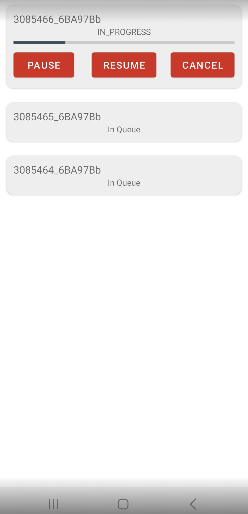

### Additional topics for download and offline playback series
# AssetQueueDownload

While the SDK enables concurrent downloads of assets, app developers have the option to enqueue these assets within the application and download them sequentially.

The reference app demonstrates the process of queuing assets at the application level and sending requests to the SDK for downloading the next asset in the queue.

###Asset Download Queue Management:

In the reference app, the DownloadBackgroundService is employed to systematically download assets from the queue, one at a time. 

For detailed implementation and code reference, please visit our GitHub repository at https://github.com/EricssonBroadcastServices/EnigmaRiverAndroidTutorialApps/tree/master/downloads/src/main/java/enigma/redbeemedia/com/downloads/DownloadBackgroundService.java.

___
[Table of Contents](../index.md) 
[Working with DRM protected offline content](download_drm_management.md) 
[AssetDownloadState](asset_download_state.md) 
[Offline Analytics events](offline_analytics.md) 
[Only download on wifi networks](set_download_requirements.md) 
&bull; AssetQueueDownload (current) 
